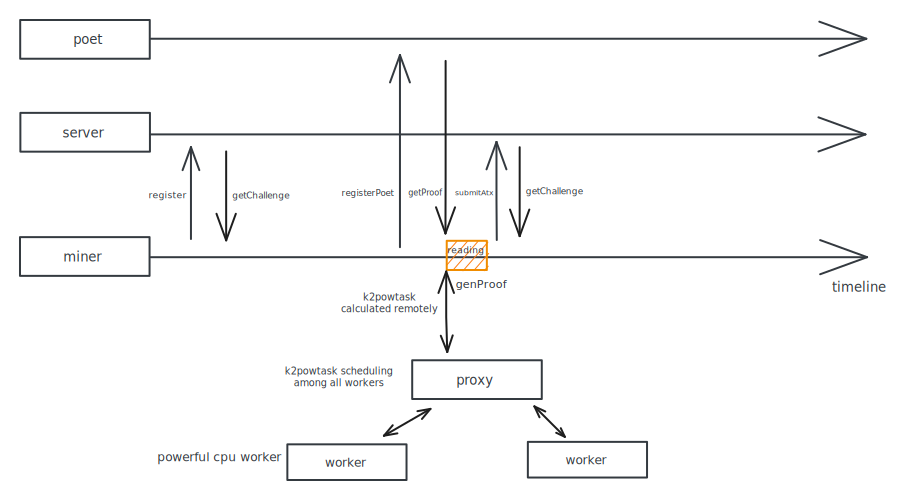

<h1 align="center">
  ZK.Work Spacemesh mining pool server
</h1>

  A mining pool service for Spacemesh blockchain.

## Architecture

## Project structure

<pre>
zkwork-smh-server
├── <a href="https://github.com/6block/go-spacemesh-privite/tree/pool-server-v1.3.10">zkwork-smh-server</a>: zkwork-smh-server
├── <a href="https://github.com/6block/go-spacemesh-privite/tree/pool-v1.2.13">zkwork-smh-miner</a>: zkwork-smh-miner
├── <a href="https://github.com/6block/post-rs-private/blob/zk-v0.4.4/farmer/src/bin/proxy.rs">zkwork-smh-proxy</a>: zkwork-smh-proxy
├── <a href="https://github.com/6block/post-rs-private/blob/zk-v0.4.4/farmer/src/bin/powworker.rs">zkwork-smh-pow-worker</a>: zkwork-smh-pow-worker
</pre>
